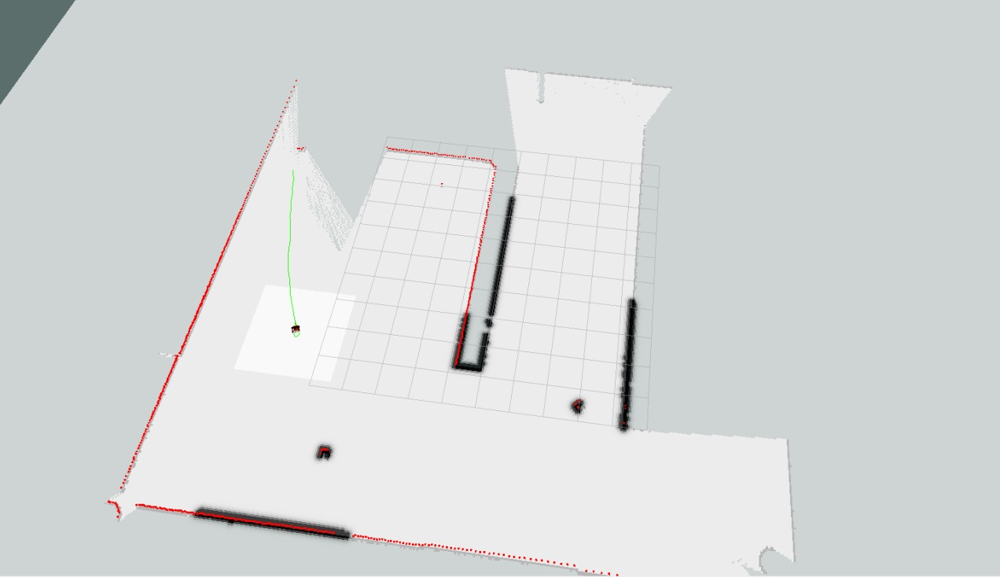
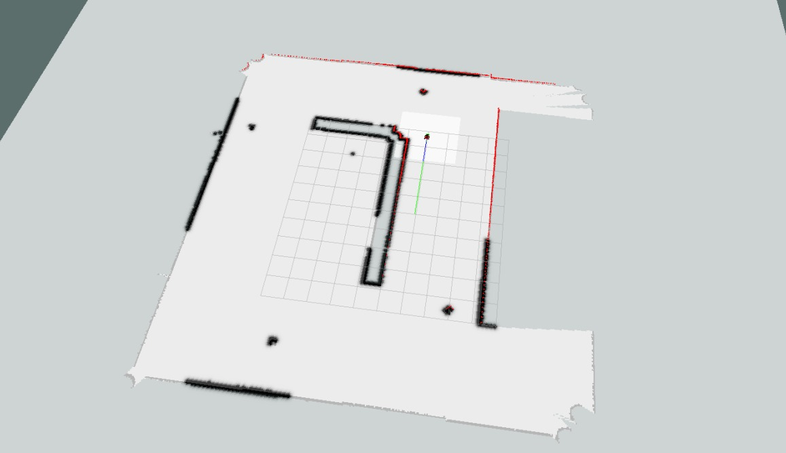
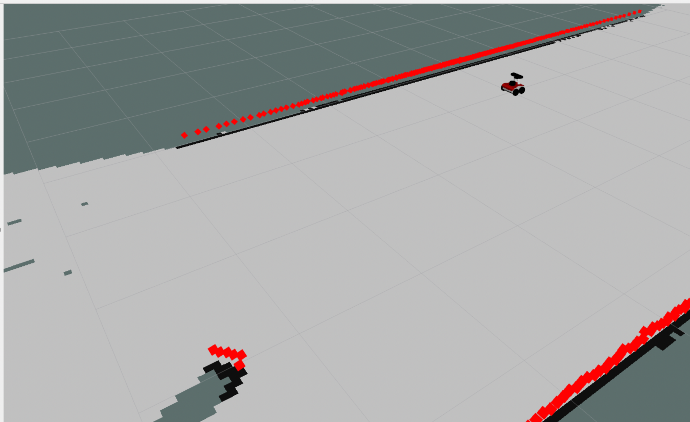

Second assignment of Experimental robotics
================================
**Simone Borelli S4662264** <br>
**Massimo Carlini S4678445** <br>
**Veronica Gavagna S5487110** <br>
**Alessio Mura S4861320** <br>

Requirements
----------------------
In our project, within a particular environment featuring four markers identified by the IDs 11, 12, 13, and 15, we aim to achieve the following tasks using a mobile robot equipped with a camera:

- **Marker Detection**: Locate and identify all the markers present within the environment.

- **Return to Initial Position**: After detecting and possibly interacting with the markers, the robot should autonomously return to its initial starting position.

- **Obstacle Avoidance**: Ensure obstacle avoidance while searching for markers and construct a local map in the process.

We will employ ROSPLAN as planning frameworks to devise and coordinate the robot's actions. Additionally, our system will utilize gmapping as the Simultaneous Localization and Mapping (SLAM) algorithm to map and determine the robot's position within the environment. Furthermore, the Move_base package will be employed for enabling autonomous navigation capabilities.

As in the [first assignment](https://github.com/alemuraa/Experimental_Assigment_1), the implementation process should start within the simulation environment before transitioning to the actual [Rosbot](https://images.app.goo.gl/AJzwbr8L3Yijjmv9A) for real-world testing and execution.


However, we were provided with certain clues regarding the marker's position. We were aware that:
* **Wp1**: Marker 11 is visible from the position x = 5.5, y = 2.5;
* **Wp2**: Marker 12 is visible from the position x = 7.0, y = -5.0;
* **Wp3**: Marker 13 is visible from the position x = -3.3, y = -7.8;
* **Wp4**: Marker 15 is visible from the position x = -7.0, y = 1.0;
* **Wp0**: Initial position is x = 0.0 and y = 1.0;

NB: the recognition of the marker IDs has been done, as in the [first assignment of Experimental](https://github.com/VeronicaG24/Assignment1_Exp ), thanks to [ArUco](http://wiki.ros.org/aruco) and [OpenCV](http://wiki.ros.org/opencv_apps) libraries, Specifically, within the `Assignment2_exp/src/aruco_ros` directory.


Planning Systems: ROSPlan
-------------------------
In our project, we have integrated the ROSPlan framework, a comprehensive suite of tools for AI Planning that seamlessly integrates with the ROS ecosystem. ROSPlan is designed to address a range of practical planning-related challenges in autonomous systems, such as problem generation, planning, and plan execution. The framework is composed of five main components:
- The Knowledge Base
- The Problem Interface
- The PlannerInterface
- The Parsing Integrace
- The Plan Dispatch

Each of these components is crucial for the seamless workflow of plan generation, execution, and communication within the system. Together, they enable autonomous systems to efficiently plan and execute tasks, making ROSPlan an indispensable tool for advanced robotic and autonomous applications.

To start, we must install certain requirements, and this can be achieved by using the following command:
```python
sudo apt-get install flex bison freeglut3-dev libbdd-dev python3-catkin-tools ros-noetic-tf2-bullet
```

To achieve our objective, we have created a launch file named `planner.launch`, inside `/Assignment2_exp/src/assignment2_exprob/launch` that configures and initiates all the essential components required to execute planning and action execution for the robot using the ROSPlan framework.

To initiate the ROSPlan framework, our main launch file includes the following line of code:
```python
<include file="$(find assignment2_exprob)/launch/planner.launch"></include>
```

To generate the executable plan, we worked on creating instances of `domain.pddl` and `problem.pddl`, named respectively `domain_turtlebot.pddl` and `problem_turtlebot.pddl` inside `/ROSPlan/rosplan_planning_system/common`.

Here a descriprion of our domain instance: 

Initially, the robot uses the `goto_waypoint` action to navigate to a position from which it can see the marker. This action is used to reach a location where the marker becomes visible to the robot's camera. Once the robot reaches the position where the marker is visible, it begins to use the `rotate` action. This action makes the robot rotate until it detects the marker centered in its camera view. <br>
After successfully aligning with the first marker, the robot uses the `goto_waypoint` action again to navigate to the next marker's location. It repeats the process of rotating and aligning itself with the new marker as needed. <br>
These steps are repeated for each subsequent marker until all markers have been visited and centered in the camera view. Once the robot has visited all the markers and the waypoint counter reaches 4 (indicating that all waypoints have been visited), the `come_back` action is activated. This action directs the robot to return to its initial position, effectively completing our goal.

Action Interface
----------------------
Our aim is to seamlessly integrate everything into our real or simulated system. The most straightforward approach is to develop nodes that extend the Action Interface node. This class facilitates the following procedure:

1. If the action name matches:
   - Verify the action for any improperly formatted parameters.
   - Update the knowledge base with initial effects.
   - Publish that the action is enabled.

2. If the action is successful (indicated by a callback):
   - Update the knowledge base with final effects.
   - Publish that the action has been achieved.

3. If the action is not successful:
   - Publish that the action has failed.
   
The class is already responsible for various tasks such as subscribing and publishing to the action dispatch topics, retrieving operator details to verify parameters, conditions, and effects, and updating the knowledge base with action outcomes.

To achieve this, we started by creating a new package named `my_rosplan_interface` inside the `/Assignment2_exp/src/my_rosplan_interface/include` folder of this package, we add a header file called `my_action.h`. This header file defines a new class named *MyActionInterface*, which extends the *RPActionInterface* class. Following that, we proceed to write the code for `my_action.cpp` within the `/Assignment2_exp/src/my_rosplan_interface/src` folder of the package. 

NB: Refer to the *Pseudocode Section* for a clearer understanding of what `my_action.cpp` accomplishes.

SLAM and Autonomous Navigation
----------------------

In our project, we have implemented Simultaneous Localization And Mapping (SLAM) using the Filtering-based approach, specifically `Gmapping`, which is a variant of FastSLAM. This method is distinguished by its use of Rao-Blackwellized particle filters, where each particle in the filter represents a distinct hypothesis of the robot's path and carries an individual map of the environment. This approach falls under the category of filter-based methods, a classical technique in robotics, which systematically performs prediction and update steps. <br>
These steps are crucial for maintaining and updating the robot's knowledge about its environment and its own state within that environment.

First of all, we need to install the *OpenSLAM GMapping* package. This can be done using the following command:
```python
sudo apt-get install ros-noetic-openslam-gmapping
```

We utilized the `gmapping` package, inside `SLAM_packages` folder which is specifically designed for SLAM with mobile robots. This package efficiently processes laser scan data to construct the map and estimate the robot's position. In fact, it subscribes essentially to the following topics:

* The `/scan` topic, from which it receives laser scan data to create the map.

* The `/tf` topic, which provides the necessary transformations to relate the frames for the base of the robot and its odometry. 

On the other side, it publishes on the following topics:
* The `/map` topic (published as a `nav_msgs/OccupancyGrid`), which contains the map data as a int8[] data. Data are expressed in row-major order. Occupancy probabilities are in the range [0, 100]. Unknown is -1.
* The `/map_metadata` topic (as a `nav_msgs/MapMetaData`), which  contains basic information about the characteristics of the Occupancy Grid, for example the time at which the map was loaded, the map resolution, its width and height, the origin of the map

To initiate the gmapping package, our launch file includes the following line of code:
```python
<include file="$(find planning)/launch/gmapping.launch"></include>
``` 

Moreover, in our project, we have implemented Autonomous Navigation, a critical functionality for robotic systems that enables them to navigate autonomously from a starting point to a goal position. This involves planning a collision-free path that may include several waypoints, while considering the robot's dynamics and avoiding static obstacles. Our implementation is based on the `MoveBase` package from the ROS Navigation stack, which offers the flexibility of choosing both global and local planners.

First of all, we need to install the *MoveBase* package. This can be done using the following command (for Ubuntu 20):
```python
sudo apt-get install ros-noetic-octomap-msgs ros-noetic-navigation ros-noetic-tf ros-noetic-move-base-msgs libsdl1.2-dev libsdl-image1.2-dev
```


For global path planning, we employ the default global planner provided by *MoveBase*, known as `navfn`. This planner utilizes *Dijkstra's algorithm*, a proven method for finding the shortest path in a graph. In our context, it efficiently computes the path with the minimum cost from the starting point to the destination.

As our local planner, we used the default `DWA Local Planner`. This planner is integral for real-time obstacle avoidance and dynamic navigation in changing environments. It relies heavily on the local costmap, which provides detailed information about nearby obstacles. This costmap is continually updated based on sensor inputs, allowing the robot to make informed decisions about its immediate surroundings.

To initiate the move_base package, our launch file includes the following line of code:
```python
<include file="$(find planning)/launch/move_base.launch"></include>
```
The following images display a segment of our project's implementation:
<table>
  <tr>
    <td>
      
    </td>
    <td>
      
    </td>
  </tr>
  <tr>
    <td>First Map View</td>
    <td>Second Map View</td>
  </tr>
</table>

The images depict a visualization of a robot in a simulated environment, where the robot is using the Gmapping SLAM (Simultaneous Localization And Mapping) algorithm to construct a map of its surroundings. In this particular scenario, the white areas in the map reflect spaces that the robot has explored and identified, while the gray areas signify regions that are yet to be discovered or are outside the robot's mapping capabilities. The black lines represent physical barriers (walls) or obstacles (ArUco markers), that the robot has detected and included in its environmental map. The green line is the trajectory that the robot will attempt to follow, avoiding any obstacles it has identified in the process of mapping.

NB: To achieve this, certain topics must be activated manually within the Rviz simulation.

Installing and running
----------------------
To initiate the entire program, you need to complete several essential steps. Firstly, it's crucial to ensure that you have the *ROS noetic*  version installed on your computer. A straightforward recommendation is to install [**Docker**](https://docs.docker.com/get-docker/) and then follow the installation instructions provided in this [**ROS guide**](http://wiki.ros.org/ROS/Installation).

Additionally, you will need to install the *xterm* terminal, which can be done by executing the following command in your terminal:

```python
sudo apt-get install xterm
``` 

You can clone our repository by executing the following command in your terminal:

```python
git clone https://github.com/VeronicaG24/Assignment2_Exp
```
Ensure that you run the provided command within the *src* folder of your workspace. Afterwards, execute the command ```catkin_make``` at the root of your workspace to build our package.

To initiate the simulation, we have prepared a main launch file. To execute it, please use the following command from your terminal:

```python
roslaunch assignment2_exprob assignment.launch
```
This launch file also combines both the environment and robot spawning, as well as the ROSPlan planner launch configuration.

When the *Gazebo* window is displayed, proceed to the planning phase by opening a new terminal tab. In this tab, navigate to the `/Assignment2_exp` folder and execute the following command:

```python
./command.sh
```
This script automates the process of generating, planning, parsing, and executing a plan within a ROS environment using ROSPlan, by initiating a series of services.

If everything is functioning correctly, you will be able to observe the *Gazebo* environment featuring the Rosbot and the markers. Additionally, you'll have *RViz* for visualizing the local map, an *xterm* terminal displaying the marker IDs, and the `/aruco_marker_publisher_result` providing insights into what the camera detects.

 
<br>
<td>Simulated Environment (Gazebo)</td>
<table><tr>
  <td>  </td>
  <td>  </td>
</tr>
<tr>
    <td>The Rviz window displays the map created through gmapping.</td>
   <td>/aruco_publisher_result window</td>
  </tr>
</table>

Pseudocode 
----------------------

The code of `my_action.cpp` is implemented through the use of a class and its methods:

```python
Include my_rosplan_interface/my_action
Include other necessary libraries

Define namespace KCL_rosplan:

    Define MyActionInterface class:
        Define Constructor MyActionInterface:
            Initialize node handle nh_
            Initialize publisher on "/cmd_vel" topic for geometry_msgs of type Twist
            Initialize subscriber to "/marker_point" topic for geometry_msgs of type Point
            Initialize variables:
              marker_center_x to 0.0
              width_camera to 320.0
              flag to true
              error to 0.0
              pixel_thr to 18.0

        Define markerPointCallback function:
            Update marker_center_x with x-coordinate from the received Point message
            Log received marker point information

        Define concreteCallback function for action execution:
            Handle 'rotate' action
            If msg.name is "rotate":
                Loop until flag is true:
                    Calculate error as the absolute difference between marker_center_x and width_camera
                    Create and publish a Twist message to rotate the robot
                    Check if error is below the pixel_thr threshold:
                        If so, stop rotation
                        Set the flag variable to false
                        Publish a Twist message to stop rotation exit loop
                Set the flag variable to true
            Handle 'goto_waypoint' and 'come_back' actions
            Else if msg.name is "goto_waypoint" or "come_back":
                Log appropriate action message based on msg.name
                Create and configure SimpleActionClient for move_base
                Create the MoveBaseGoal object
                Wait for action server to start
                Set the orientation of the goal target to 1.0
                Check if the third parameter of msg is "wp1":
                  If so, set target position coordinates for waypoint 1
                Check else if the third parameter of msg is "wp2":
                  If so, set target position coordinates for waypoint 2
                Check else if the third parameter of msg is "wp3":
                  If so, set target position coordinates for waypoint 3
                Check else if the third parameter of msg is "wp4":
                  If so, set target position coordinates for waypoint 4
                Check else if the third parameter of msg is "wp0":
                  If so, set target position coordinates for waypoint 0
            Wait for the goal to be achieved or aborted
            Log action completion message
            Return a boolean true as returned value

    Define main function:
        Initialize ROS
        Create MyActionInterface object
        Run the action interface
```


Simulation videos
----------------------
The video presented here demonstrates a portion of our project's functionality within a simulated environment (Gazebo): 

 
 

Real robot video
----------------------
You can observe the behavior of the real robot, **ROSbot 2**, which is similar to the simulation, but due to the limited space, the markers cannot be visible exactly in the same positions. The video in the small box represents what the camera sees.

The code used can be found on the same repository but in the `real_robot` branch.

Possible improvements
----------------------
Here are some possible improvements:

* Although it has been possible to implement all the code related to the robot's actions in my_action.cpp file, a future implementation could aim at making the code more modular. To achieve this, it would be better to move the code related to the two *if statements* in the my_action.cpp file into separate functions; however, this could lead to delays during the code execution phase, since everything is executed within a callback.
* As seen in the simulation video, it takes about 15 minutes to complete the search for all four markers. This is obviously computationally inefficient; a solution might be to perform a performance analysis using other SLAM algorithms, such as **KartoSLAM**, which uses a graph-based approach for map creation, thus minimizing cumulative error, which could be important in complex environments. Additionally, the graph-based approach allows for better trajectory optimization compared to **GMapping**. Of course, whether there can be an actual improvement with **GMapping** in our environment, we can only know by implementing it and analyzing its computational complexity.
* An improvement to the current navigation system could involve the addition of a dedicated "environment exploration" phase prior to executing waypoint navigation. This phase would task the robot with methodically scanning the surroundings to construct a more complete and detailed map of the environment. By doing so, the robot would acquire a greater understanding of potential obstacles and free paths, which in turn would facilitate more optimal route planning. This strategy would likely decrease the chances of the robot needing to recalibrate its path mid-route due to encountering unforeseen obstacles. Consequently, this would improve the robot's overall efficiency in reaching its waypoints, as it would start with a more informed route plan.

