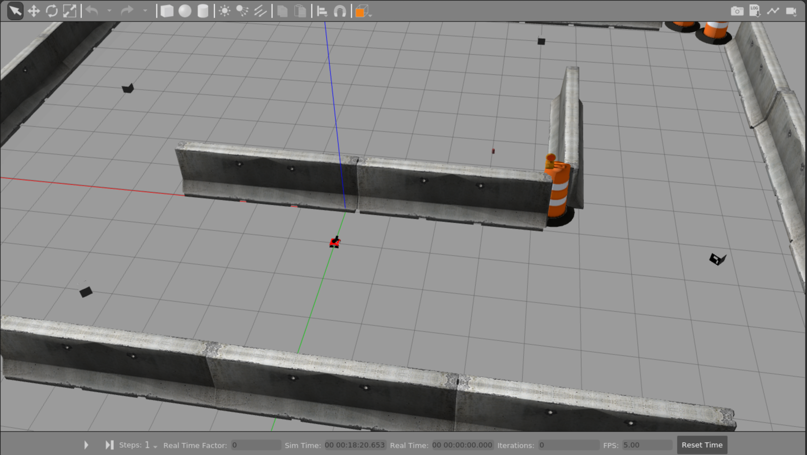

Second assignment of Experimental robotics
================================
**Simone Borelli S4662264** <br>
**Massimo Carlini S4678445** <br>
**Veronica Gavagna S5487110** <br>
**Alessio Mura S4861320** <br>

Requirements
----------------------

The purpose of the second assignment of Experimental robotics is to let the robot reaching the markers using planned actions thanks to [ROSplan](https://kcl-planning.github.io/ROSPlan/). In addition the robot needs to avoide obstacles, and building the local map thanks to one of the possible [SLAM](https://github.com/CarmineD8/SLAM_packages) algorithm.

As in the first assignment, the implementation must be done first in simulation (the world file assignment2.world is given), then with the real **Rosbot**.

To summarize, the mobile robot endowed with a camera has to:
* find the four markers in the environment;
* go back to the initial position;

Knowing that:
* marker 11 is visible from the position x = 6.0, y = 2.0;
* marker 12 is visible from the position x = 7.0, y = -5.0;
* marker 13 is visible from the position x = -3.0, y = -8.0;
* marker 15 is visible from the position x = -7.0, y = -1.5;
* initial position is x = 0.0 and y = 1.0;


Implementation
----------------------

This is a possible implementation of the second assignment of Experimental for Robotics course. <br>
*For further information about the first assignment see the repository at this link:* https://github.com/VeronicaG24/Assignment1_Exp 

The robot with fixed camera, thanks to the planning of actions, reaches the designated position where the marker is visible, and starts to rotate in order to find the correct orientation with which the center of the camera aligns with that of the marker. Once the detection of all the markers has been done, the robot has to come back to the initial position.

To implement the actions explained before, we had to work respectively on the following files:
* `domain.pddl`, inside `ROS_planning_system` folder of `ROS_plan` package: <br>
    - *Functions* are introduced to count the number of visited waypoints. *Predicates* include conditions like a robot being at a waypoint, a waypoint being visited, or the robot's ability to rotate or move. *Actions* defined include 'rotate', where a robot rotates to find a waypoint, 'goto_waypoint', where the robot moves to a waypoint avoiding terrain, and 'come_back', where the robot returns to the initial position after visiting a certain number of waypoints.

* `problem.pddl`, inside `ROS_planning_system` folder of `ROS_plan` package: <br>
    - we define the goal of the planning to let the robot accomplish the requirements of finding all markers (waypoints) in the environment and going back to the initial position.
* To let the pddl action interact with the robot it is necessary to modify the file `my_action.cpp`, inside `my_rosplan_interface` folder. <br>
NB: The part related to action_client and action_server are already implemented into `rt2_packages`.
    - In the *rotate* action we develop the linear control to rotate the robot and allign the center of the camera with the center of the marker.
    - In the *goto_waypoint* action we set the coordinates of the four markers and send them to the `reaching_goal` server.
    - In the *come_back* action we set the coordinates of the initial position (0,1) and send it to the `reaching_goal` server.

To generate the local map and to avoid the obstacles, we worked on the SLAM algorithm:
* gmapping?? 


Installing and running
----------------------
For start the whole program, you have to do some several, but fundamental, step. First of all it is important to have **ROS noetic** version on your pc; the best simple suggestion is to have the [**Docker**](https://docs.docker.com/get-docker/) and then follow this [**ROS guide**](http://wiki.ros.org/ROS/Installation). In addition it is required to install **xterm** terminal; you can do that by using the command on your terminal:

```python
sudo apt-get install xterm
``` 

You can clone our repository, by clicking on the terminal:

```python
git clone https://github.com/VeronicaG24/Assignment2_Exp
```

Make sure to execute the above command within the **src** folder of your workspace. Then execute ```catkin_make``` inside the root of your workspace for building our package. <br>

To generate the planning, write this command in the terminal:

```python
./command.sh
```

After that, to run the simulation, launch the following command from the terminal:

```python
roslaunch rosbot_bringup test.launch
```

If everything works properly, you should visualize the **Gazebo** environment with the Rosbot and the markers, the **RViz** ti visualize the local map, a **xterm** terminal for showing the id of the marker, and the **/aruco_marker_publisher_result** which simply shows what the camera detects. 

 
<table><tr>
  <td>  </td>
  <td>  </td>
</tr>
<tr>
    <td>Rviz window</td>
   <td>/aruco_publisher_result window</td>
  </tr>
</table>

Pseudocode 
----------------------

The code of `my_action.cpp` is implemented through the use of a class and its methods:

```python
Include my_rosplan_interface/my_action
Include other necessary libraries

Define namespace KCL_rosplan:

    Define MyActionInterface class:
        define Constructor MyActionInterface:
          Initialize node handle, publishers, and subscribers
          Initialize variables like marker_center_x to 0.0, marker_id to 0, width_camera to 320.0, flag to true, error to 0.0,pixel_thr = 18.0

        define Callback for ID updates:
          Update marker_id with received message data

        define Callback for marker point updates:
          Update marker_center_x with received message data

        define Main action callback:
            Handle 'rotate' action
            If msg.name is "rotate":
                Loop until flag is false:
                    Calculate error
                    Publish rotation command
                    Check if error is below threshold, if so, exit loop

            Handle 'goto_waypoint' and 'come_back' actions
            Else if msg.name is "goto_waypoint" or "come_back":
                Create SimpleActionClient for move_base
                Wait for server and set up goal
                Determine target position based on msg parameters
                Send goal and wait for result

            Log action completion

    Define main function:
        Initialize ROS
        Create MyActionInterface object
        Run the action interface
```


Simulation videos
----------------------
You can see the video of the simulations: 

 
 

Real robot video
----------------------
You can observe the behavior of the real robot, **ROSbot 2**, which is similar to the simulatio but due to the limited space the markers cannot be exactly in the same positions. The video in the small box represents what the camera sees.

The code used can be found on the same repository but in the `real_robot` branch.

 


Possible improvements
----------------------
Here are some possible improvements:

* Although it has been possible to implement all the code related to the robot's actions in my_action.cpp file, a future implementation could aim at making the code more modular. To achieve this, custom services could be implemented that, when invoked, activate or deactivate certain behaviors of the robot

